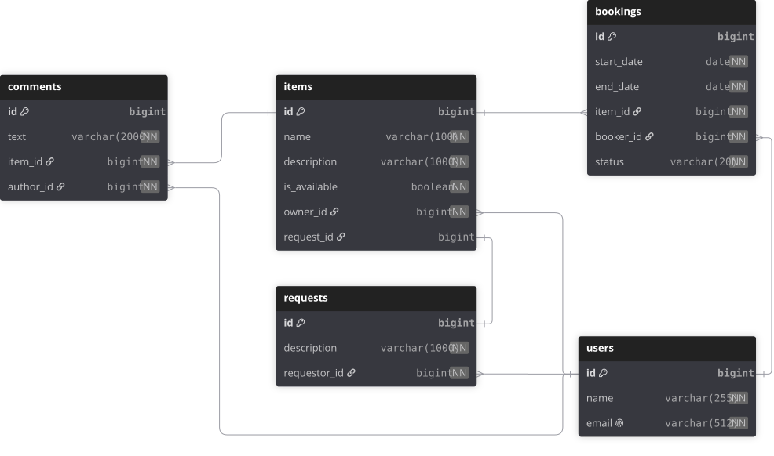

# java-shareit
Проект ShareIt обеспечивает пользователям, во-первых, возможность рассказывать, какими вещами они готовы поделиться, 
а во-вторых, находить нужную вещь и брать её в аренду на какое-то время.

## Описание проекта
Проект представляет собой RESTful API, разработанное с использованием Spring Boot.
Основная цель приложения — предоставить функционал для управления арендой вещей и оценками пользователей.

## База данных
Для хранения данных используется реляционная база данных. В проекте реализованы сущности для вещей,
пользователей, комментариев, бронирования, запросы на аренду вещи. 
Каждая сущность имеет свои атрибуты и связи с другими сущностями.

# ER-диаграмма базы данных:

  

База данных нормализована к третьей нормальной форме (3NF), 
что обеспечивает минимизацию избыточности данных и улучшает целостность данных.