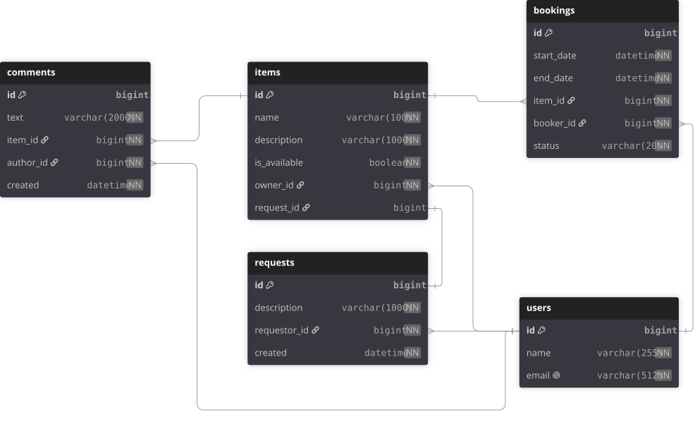

# java-shareit
**Stack:** Java, Spring Boot, PostgreSQL, JPA, Docker, REST API

ShareIt — сервис шеринга вещей. Пользователь публикует вещи, которыми готов поделиться, находит нужные вещи,
бронирует их на период, оставляет комментарии после использования и создаёт запросы на вещи, которых в сервисе нет.

Архитектура: `gateway` (первичная валидация, порт 8080) → `server` (бизнес-логика, JPA, PostgreSQL/H2, порт 9090).
Идентификация пользователя — заголовок `X-Sharer-User-Id`.

## Описание проекта
Проект представляет собой RESTful API, разработанное с использованием Spring Boot.
Основная цель приложения — предоставить функционал для управления арендой вещей и оценками пользователей.

## База данных
Для хранения данных используется реляционная база данных. В проекте реализованы сущности для вещей,
пользователей, комментариев, бронирования, запросы на аренду вещи. 
Каждая сущность имеет свои атрибуты и связи с другими сущностями.

# ER-диаграмма базы данных:

  

База данных нормализована к третьей нормальной форме (3NF), 
что обеспечивает минимизацию избыточности данных и улучшает целостность данных.

## API

Клиенты работают с **gateway** (`http://localhost:8080`), он валидирует запросы и передаёт их в **server** (`:9090`).
Формат обмена — JSON, даты — ISO-8601 (`2030-01-01T10:00:00`).

### Пользователи — `/users`

| Метод | Путь | Тело запроса | Успешный ответ |
|-------|------|--------------|----------------|
| `POST` | `/users` | `{"name": "Ivan", "email": "ivan@mail.ru"}` — оба поля обязательны, `name` ≤ 100 символов, `email` уникален | `201` |
| `GET` | `/users` | — | `200`, список |
| `GET` | `/users/{id}` | — | `200` |
| `PATCH` | `/users/{id}` | `{"name": "...", "email": "..."}` — любые из полей | `200` |
| `DELETE` | `/users/{id}` | — | `204` (вместе с пользователем удаляются его вещи, брони, запросы, комментарии) |

### Вещи — `/items`

| Метод | Путь | Параметры / тело | Успешный ответ |
|-------|------|------------------|----------------|
| `POST` | `/items` | `{"name": "Дрель", "description": "...", "available": true, "requestId": 1}` — `name` ≤ 100 символов; `requestId` необязателен | `200` |
| `PATCH` | `/items/{itemId}` | `{"name": "...", "description": "...", "available": false}` — любые из полей; только владелец | `200` |
| `GET` | `/items` | — | `200`, вещи владельца с `lastBooking`, `nextBooking`, `comments` |
| `GET` | `/items/{itemId}` | — | `200`; `lastBooking` и `nextBooking` видит только владелец |
| `GET` | `/items/search?text=` | `text` — подстрока названия или описания (без учёта регистра); ищет только доступные вещи, при пустом `text` — `[]` | `200` |
| `POST` | `/items/{itemId}/comment` | `{"text": "Отлично"}` — до 2000 символов; нужна завершённая подтверждённая бронь этой вещи | `200` |

### Бронирования — `/bookings`

| Метод | Путь | Параметры / тело | Успешный ответ |
|-------|------|------------------|----------------|
| `POST` | `/bookings` | `{"itemId": 1, "start": "...", "end": "..."}` — `start` не в прошлом, `end` в будущем и позже `start`; вещь должна быть доступна, владелец не может бронировать свою вещь. Статус новой брони — `WAITING` | `200` |
| `PATCH` | `/bookings/{bookingId}?approved=true\|false` | Только владелец вещи; решение принимается один раз → `APPROVED` / `REJECTED` | `200` |
| `GET` | `/bookings/{bookingId}` | Доступно автору брони и владельцу вещи | `200` |
| `GET` | `/bookings?state=` | Бронирования пользователя | `200`, новые первыми |
| `GET` | `/bookings/owner?state=` | Бронирования вещей пользователя-владельца | `200`, новые первыми |

`state`: `ALL` (по умолчанию), `CURRENT`, `PAST`, `FUTURE`, `WAITING`, `REJECTED` (регистр не важен).

### Запросы вещей — `/requests`

| Метод | Путь | Тело | Успешный ответ |
|-------|------|------|----------------|
| `POST` | `/requests` | `{"description": "Нужна дрель"}` — до 200 символов, у пользователя не должно быть запроса с таким же текстом | `201` |
| `GET` | `/requests` | — | `200`, собственные запросы с предложенными вещами, новые первыми |
| `GET` | `/requests/all` | — | `200`, запросы других пользователей, новые первыми |
| `GET` | `/requests/{requestId}` | — | `200` |

### Ошибки

Тело ошибки: `{"error": "Ресурс не найден", "description": "Вещь с id=99 не найдена"}`

| Код | Причина |
|-----|---------|
| `400` | Невалидное тело или параметры, нарушение правил бронирования/комментирования, неизвестный `state` |
| `403` | Нет прав: не владелец вещи или брони |
| `404` | Пользователь, вещь, бронь или запрос не найдены |
| `409` | Email уже занят; дублирующийся запрос вещи |